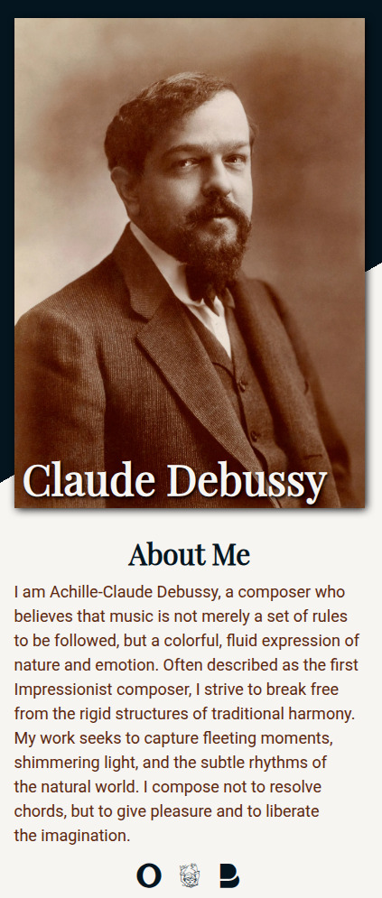
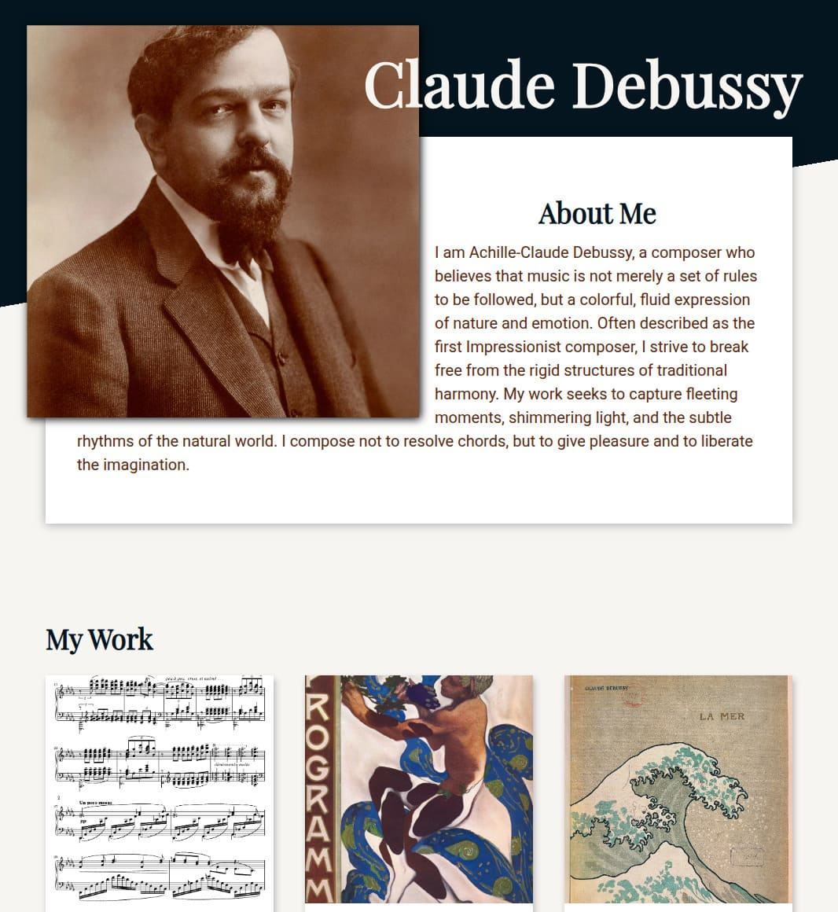

# Claude Debussy Tribute Page

A responsive, dynamically rendered tribute page for composer Claude Debussy. This project demonstrates modern front-end development practices, including JavaScript-driven responsive design, Webpack bundling, and component-based CSS architecture.

## 📱 Preview

|                        Mobile Layout                        |                        Tablet Layout                        |
| :---------------------------------------------------------: | :---------------------------------------------------------: |
|  |  |

_(Note: Desktop view adapts to wider viewports with a 3-column layout.)_

## 🚀 Features

- **JavaScript-Driven Responsiveness:** Unlike traditional CSS-only media queries, this project utilizes the `window.matchMedia` API to detect viewport changes and dynamically inject different HTML structures for Mobile, Tablet, and Desktop views.
- **Webpack Asset Management:**
  - Bundles JavaScript, CSS, and Images.
  - Uses `html-webpack-plugin` for HTML generation.
  - Configured with `css-loader` and `style-loader` for modular styles.
- **Modern CSS:**
  - Utilizes CSS Variables for consistent theming (colors, fonts).
  - Implements a custom CSS reset (`modern-css-reset.css`).
  - Responsive layouts using Flexbox and Grid.
- **Linting & Formatting:** Enforces code quality using **ESLint** and **Prettier**.

## 🛠️ Tech Stack

- **Core:** JavaScript (ES6+), HTML5, CSS3
- **Build Tool:** Webpack 5
- **Styling:** Custom CSS, Devicon (for icons)
- **Quality Control:** ESLint, Prettier

## 📂 Project Structure

```text
/src
  ├── fonts/               # Local font files
  ├── index.html           # HTML template
  ├── index.js             # Main entry point & Responsive logic
  ├── modern-css-reset.css # CSS Reset
  └── styles.css           # Main stylesheets
/dist                      # Compiled assets (generated by Webpack)
package.json               # Dependencies and scripts
webpack.config.js          # Webpack configuration
```

## ⚙️ Logic Highlight: Dynamic Rendering

This project explores using the `MatchMedia` API to handle structural DOM changes. Instead of just hiding elements with CSS, the JavaScript detects the breakpoint and re-renders the Header component to fit the context.

```javascript
const mobileQuery = "(max-width: 767px)";
const tabletQuery = "(min-width: 768px) and (max-width: 1279px)";

const mobileMQL = window.matchMedia(mobileQuery);
const tabletMQL = window.matchMedia(tabletQuery);

function updateHeader() {
  const header = document.querySelector(".header-container");

  if (tabletMQL.matches) {
    // Logic to render Tablet Layout HTML
  } else if (mobileMQL.matches) {
    // Logic to render Mobile Layout HTML
  } else {
    // Logic to render Desktop Layout HTML
  }
}

// Event Listeners for viewport changes
mobileMQL.addEventListener("change", updateHeader);
tabletMQL.addEventListener("change", updateHeader);
```

## 💻 Getting Started

### Prerequisites

- Node.js (v18 or higher recommended)
- npm

### Installation

1.  Clone the repository:

    ```bash
    git clone https://github.com/ClaudeDebussy/dropdown.git
    cd dropdown
    ```

2.  Install dependencies:

    ```bash
    npm install
    ```

3.  Run the development server:

    ```bash
    npm start
    ```

4.  Build for production:
    ```bash
    npm run build
    ```

## 📝 License

This project is licensed under the MIT License.
